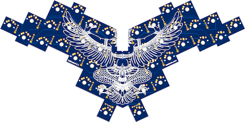

# Balbuzard


Balbuzard is a 36-key keyboard with a PCB. This repository contains the [Ergogen](https://github.com/mrzealot/ergogen) configuration that generates the KiCad PCB file.

## Usage

Assuming you have [npm installed](https://www.npmjs.com/get-npm):

``` sh
git clone --recursive git@github.com:brow/balbuzard.git
cd balbuzard
make
```

Find the generated PCB at `output/pcbs/main.kicad_pcb`.



## How do you type on that?

My keymap looks like this. The colors indicate which finger I use to hit each key.


## Rev 1.

* Ergogen config upgraded to latest 3.0.0
* Column layout tweaked, ready for routuing
* Each key / diode is routed.  Next is to route columns and rows (AKA the hard part)
* Removed routing done since I've found a way in Kicad to make direct connections (which will make the key routing cleaner looking)
* Redid the key / diode routing to use straight tracks wherever I could. 
* Just went ahead and used [an autorouter called Freerouter.](https://github.com/freerouting/freerouting/)
* After much gnashing of teeth, I have the scales SVG working.  Now to add to the front / back of PCB.

Front SVG Export:
Edge.Cuts
F.Silkscreen
F.Mask

Back SVG Export:
Edge.Cuts
B.Silkscreen
B.Mask

# TODO

* Add Balbuzard silkscreen on the front of the PCB
* Add something to the back of the PCB?  Thinking maybe a pattern like this: https://pattern.monster/scales-3/

**Note:** If there is a Rev 2. you will need to rotate the left side buttom-most thumb key's diode.  Rotated manually in Kicad to make it easier to route without routing on the back side.
